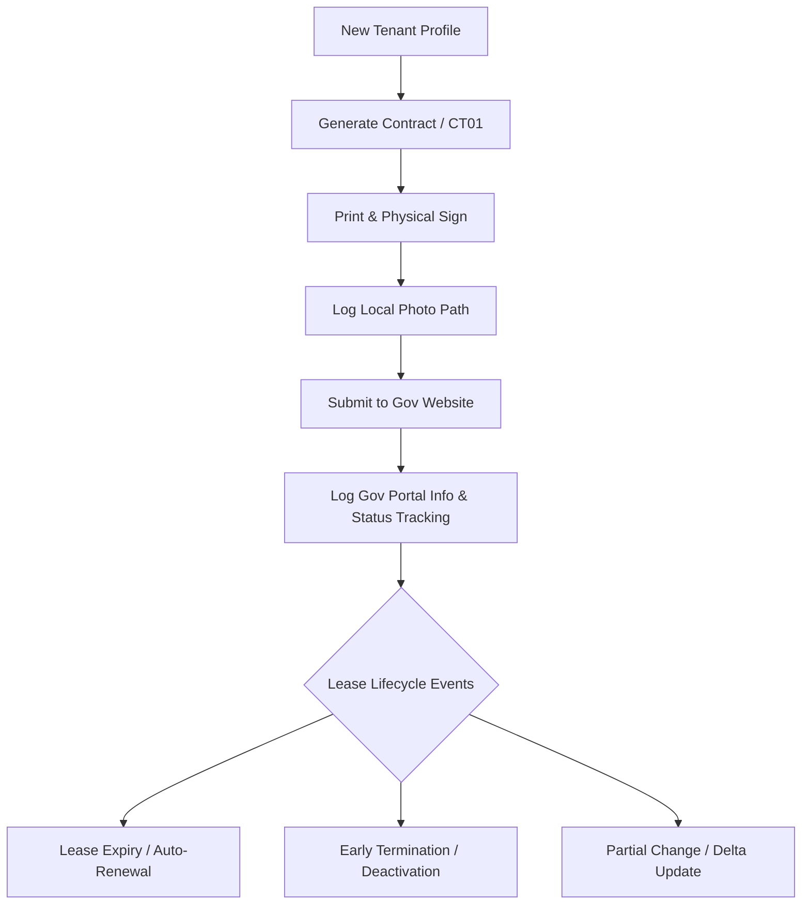

# Software Requirements Specification (SRS)

## Project: Local-First Rental & Residence Management System

---

## 1. Introduction

### 1.1 Purpose

This document specifies the functional and non-functional requirements for a local-first desktop or desktop-web application. The system eliminates the manual data entry overhead of managing tenants by maintaining a local database, tracking lease lifetimes, and automatically compiling standardized Vietnamese residency forms and rental contracts.

### 1.2 Scope & Local-First Philosophy

- **Data Privacy & Ownership:** All data is stored locally on the user's machine (e.g., SQLite, IndexedDB, or local JSON files). No cloud databases or external image hosting services are utilized.
- [cite_start]**Physical Loop Compliance:** Vietnamese registration requires physical signatures on paperwork [cite: 16] [cite_start]and image/scan uploads to the government portal[cite: 44, 45]. The system acts as a digital text-aggregator and pre-filler, bridging the gap between local record-keeping and manual government portal execution.

---

## 2. General Description

### 2.1 User Role

- **Landlord (System Operator):** The property owner(s) who manages rental units, registers tenant profiles, tracks durations, and exports pre-filled regulatory paperwork.

### 2.2 System Constraints & Business Rules

- [cite_start]**Landlord Configuration (Bên A):** The system must support a minimum of 1 owner and a maximum of 2 owners[cite: 21, 22, 24].
- **Gender Flexibility:** The system must allow the 1 or 2 owners to be any gender combination (both male, both female, or mixed).
- **No Cloud Assets:** The system does not capture, store, or process image binary files. Instead, it tracks alphanumeric text strings pointing to local system directories where physical document photographs or scanned government receipts are stored.

---

## 3. Data Schema & Entities (Local Storage)

### 3.1 Landlord Profile (`Landlord_Profile`)

- [cite_start]**Constraints:** Minimum 1 record, maximum 2 records[cite: 21, 22, 24].
- **Fields:**
  - `Owner_ID` (Primary Key)
  - [cite_start]`Full_Name` (Text) [cite: 22, 24]
  - [cite_start]`Year_Of_Birth` (Integer) [cite: 22, 24]
  - `Gender` (Enum: Male, Female)
  - [cite_start]`CCCD_Number` (String - Validation: Exactly 12 digits) [cite: 22, 24]
  - [cite_start]`Permanent_Address` (Text) [cite: 23, 25]

### 3.2 Rental Property (`Rental_Property`)

- **Fields:**
  - `Property_ID` (Primary Key)
  - [cite_start]`Full_Address` (Text) - _Defaults to: 123 Đường ABC, Phường XYZ_ [cite: 27]

### 3.3 Tenant Household (`Tenant_Household`)

- **Fields:**
  - `Household_ID` (Primary Key)
  - [cite_start]`Primary_Tenant_Name` (Text) [cite: 7, 29]
  - [cite_start]`DOB` (Date) [cite: 8]
  - [cite_start]`Gender` (Enum: Male, Female) [cite: 8]
  - [cite_start]`National_ID` (String - Validation: Exactly 12 digits) [cite: 9, 29]
  - [cite_start]`Phone` (String) [cite: 10]
  - [cite_start]`Email` (String) [cite: 10]
  - [cite_start]`Is_Household_Head` (Boolean) [cite: 11]

### 3.4 Co-Occupants (`Co_Occupants`)

- **Fields:**
  - `Occupant_ID` (Primary Key)
  - `Household_ID` (Foreign Key linked to `Tenant_Household`)
  - [cite_start]`Full_Name` (Text)
  - [cite_start]`DOB` (Date)
  - [cite_start]`Gender` (Enum: Male, Female)
  - [cite_start]`National_ID` (String - Validation: Exactly 12 digits)
  - [cite_start]`Relationship_To_Head` (Text)

### 3.5 Lease Agreement (`Lease_Agreement`)

- **Fields:**
  - `Lease_ID` (Primary Key)
  - [cite_start]`Room_Number` (Text) [cite: 40]
  - [cite_start]`Duration_Years` (Integer) [cite: 42]
  - [cite_start]`Monthly_Rent` (Text/Currency) [cite: 43]
  - [cite_start]`Start_Date` (Date) [cite: 20]
  - `End_Date` (Date)
  - `Contract_Status` (Enum: Draft, Active, Expired, Terminated)
  - `Local_Photo_Path_String` (Text - Path location on local computer disk)

### 3.6 Government Registration Log (`Gov_Registration_Log`)

- **Fields:**
  - `Log_ID` (Primary Key)
  - `Lease_ID` (Foreign Key linked to `Lease_Agreement`)
  - `Gov_Contract_ID` (String - Registration code from government portal)
  - `Submission_Date` (Date - Date submitted to website)
  - `Release_Date` (Date/Optional - Date registration approved/released)
  - `Portal_Status` (Enum: Pending, Approved, Rejected)
  - `Physical_Paper_Status` (Enum: Not_Collected, Collected_At_Police_Station, Filed_At_Home)
  - `Physical_Storage_Note` (Text - e.g., "Folder A, Shelf 2" to track physical location)

---

## 4. Functional Requirements (FR)

### 4.1 Input Validation Rules

- [cite_start]**FR-1.1:** The system must validate that Citizen Identity Cards (`CCCD_Number` and `National_ID`) consist of exactly 12 numeric characters[cite: 9, 12, 15, 22, 24, 29].
- **FR-1.2:** The system must validate that the contract end date is chronologically later than the contract start date.
- [cite_start]**FR-1.3:** The system must restrict the Landlord submission screen from saving if more than 2 owners are activated[cite: 21, 22, 24].

### 4.2 Document Generation Engine

- **FR-2.1 (Contract Compilation):** The system must export a completed text file or markdown/document draft using the data inputs:
  - [cite_start]Dynamically populates either 1 or 2 owners under the "Bên A" block based on active profiles[cite: 21, 22, 24].
  - [cite_start]Maps the Primary Tenant under "Bên B"[cite: 28, 29].
- [cite_start]**FR-2.2 (CT01 Form Compilation):** The system must map data points to the fields corresponding to Form CT01[cite: 1]:
  - [cite_start]Hardcodes Section 10 "Nội dung đề nghị" to "Đăng ký tạm trú"[cite: 13].
  - [cite_start]Compiles all active `Co_Occupants` into the structured data matrix matching Section 11.

### 4.3 Lifecycle & Workflow Management

#### Flow A: New Tenant Entry

- [cite_start]**FR-3.1:** Allow the Landlord to input primary tenant details and append any number of accompanying friends/family members. [cite: 15]
- **FR-3.2:** Provide a "Log Signed Path" text tool where the Landlord saves the text string directory location of the executed paperwork photos for easy reference when utilizing government upload mechanisms.

#### Flow B: Contract Expiration & Renewal

- **FR-4.1:** The dashboard must display a notification flag when an active contract crosses its expiration threshold.
- **FR-4.2:** Provide an automated "Renew Lease" option. This actions a cloning function where current landlord, property, tenant, and co-occupant records are pulled into a new template without re-keying data. The user modifies only the duration parameters.

#### Flow C: Early Termination

- **FR-5.1:** Allow the user to mark an active lease instance as prematurely closed.
- **FR-5.2:** Retain the historical logs locally while changing the current tenant status to "Inactive".
- **FR-5.3:** Pre-fill termination clearing files utilizing the data already resident within the local storage layer.

#### Flow D: Partial Tenant Departures

- [cite_start]**FR-6.1:** When one or more co-occupants leave a household while others remain, the user must be able to toggle the status of specific individuals in the `Co_Occupants` list. [cite: 15]
- [cite_start]**FR-6.2:** The system must generate an updated, isolated version of Form CT01 containing only the adjusted household tracking layout, keeping remaining, static tenant components intact to bypass full re-registration setups. [cite: 14, 15]

### 4.4 Government Verification & Audit Tracking

#### Flow E: Portal Data Sync & Status Tracking

- **FR-7.1:** The system must provide input fields within each tenant's profile to record government portal interaction details: `Gov_Contract_ID`, `Submission_Date`, and `Release_Date`.
- **FR-7.2:** The system must maintain a quick-copy utility button next to the `Gov_Contract_ID` so the user can copy the alphanumeric tracking ID instantly with one click for easy pasting into the official government website search tool.

#### Flow F: Physical Proof Document Receipt & Storage Logistics

- **FR-8.1:** The system must provide a status tracker for physical paper documents received from authorities (`Physical_Paper_Status`): `Not_Collected`, `Collected_At_Police_Station`, or `Filed_At_Home`.
- **FR-8.2:** The system must include a text area field (`Physical_Storage_Note`) allowing the user to type descriptions specifying the physical folder or filing location of the paper certificates (e.g., _"Box 2, Blue Binder"_).

#### Flow G: Compliance Search Quick-Look (Audit Defense)

- **FR-9.1:** The system must feature a global text search box on the main dashboard to handle unannounced government or police inspection calls instantly.
- **FR-9.2:** The dashboard search feature must filter and pull up a tenant profile immediately when searching by Tenant Name, Room Number, Citizen ID (CCCD), or `Gov_Contract_ID`.
- **FR-9.3:** When an inspected record is open, the system must clearly group and highlight the verification data: Submission Date, Release Date, Government Online Tracking ID, and the exact physical filing location notes to quickly prove alignment with local authorities.

---

## 5. Non-Functional Requirements (NFR)

- **NFR-1 (Security & Isolation):** Because the app houses sensitive data assets (National IDs, telephone logs, and structural residential records), data must not leave the physical device unless handled explicitly via print layouts or exported templates by the owner.
- **NFR-2 (Performance):** Document compiling and structural database queries must evaluate locally without requiring network handshakes or active broadband access.
